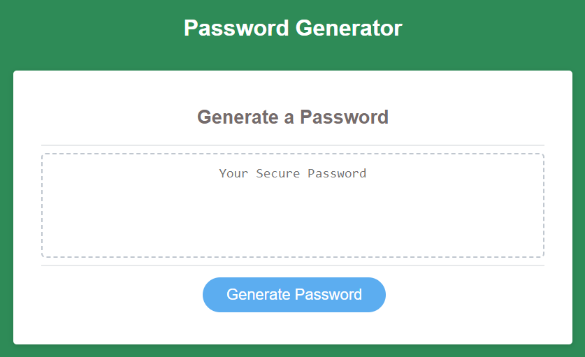

# password-generator

## Description

This password generator was created with HTML, CSS and JavaScript and will generate a secure password according to the user's specifications.

## Usage

- Click the "Generate Password button
- Enter the character length you want your password to be
- Click OK to include special characters, Cancel for no special characters
- Click OK to include lowercase characters, Cancel for no lowercase characters
- Click OK to include uppercase characters, Cancel for no uppercase characters
- Click OK to include numbers, Cancel for no numbers
- You may now select and copy your generated password

Here is the live website. [Try it out!](https://shanna-not-shawna.github.io/password-generator/)

## Credits

Dominique Meeks Gombe provided tutoring and guidance on this project.

## How to Contribute

If you would like to contribute to this project, please reach out to the author.
